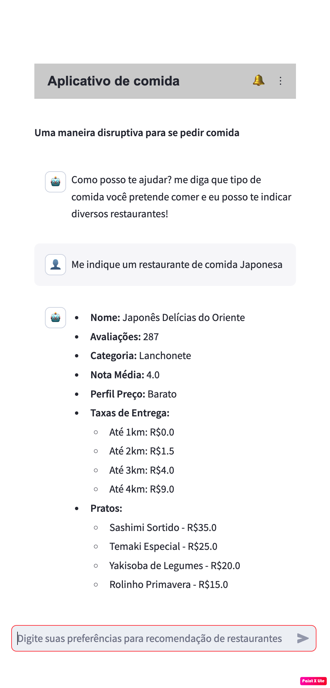

# TCC - Ambiente de Desenvolvimento

Este documento descreve os passos necessários para configurar o ambiente de desenvolvimento do projeto TCC utilizando Python, Virtualenv e como rodar o protótipo.

# Requisitos

- Python instalado na versão 3.12.3 ou mais recente ([Linux](https://python.org.br/instalacao-linux/), [Windows](https://python.org.br/instalacao-windows/) ou [macOS](https://python.org.br/instalacao-mac/)).
- `pip` instalado para gerenciar pacotes Python.
- Criando chaves necessarias para acesso de API do Google Geocoding e OpenAI
    - Chave de API do OpenAI. 
        - [Instruções para obter a chave da OpenAI](OPENAI.md)
    - Chave de API do Google Geocoding (opcional, caso não gere, o protótipo não deixa de funcionar). 
        - [Instruções para obter a chave da Google Geocoding](GOOGLE_GEOCODING.md)
    - Com as chaves em mãos, criar arquivo na pasta deste projeto com nome `.env` [Instruções para se criar arquivo](OPENAI.md)
        - `OPENAI_API_KEY=OPENAI_API_KEY`
        - `GOOGLE_GEOCODING_API_KEY=GOOGLE_GEOCODING_API_KEY`


## Passos para configuração do ambiente

### 1. Verificar a versão do Python

Antes de iniciar, verifique se o Python está instalado corretamente.

```bash
python --version
```

### 2. Criar o ambiente virtual
Crie um ambiente virtual chamado tcc:

```bash
virtualenv tcc
```

### 3. Ativar o ambiente virtual
- macOS/Linux:
```bash
source tcc/bin/activate
```
- Windows
```bash
tcc\Scripts\activate
```

### 4. Instalar dependências
Com o ambiente virtual ativo, instale as dependências do projeto utilizando o arquivo requirements.txt:

```bash
pip install -r requirements.txt
```

# Rodando o protótipo

### 1. Geração de dados sintéticos

O projeto foi estruturado em tres pasta, a primeira chamada `dados_sinteticos`, onde dentro desta pasta possui script para geração de dados sintéticos, sendo necessario executar esta etapa apenas uma unica vez, caso você execute outras vezes, os arquivo novos estão sendo salvos na pasta `dados_sinteticos/sucesso_*modelo*`, onde *modelo* é justamente o modelo escolhido por ti. 

Modelos suportado:
- `gpt-3.5-turbo`
- `gpt-4-turbo`

Como executar primeira etapa:
```bash
python dados_sinteticos/gerador.py  --restaurantes 400 --modelo "gpt-3.5-turbo"
```

Costuma demorar um pouco a variar de acordo com a quantidade de restaurantes que vocês especificou, exemplo de log de saida:

```
✅ ✅ ✅ ✅ ✅ ✅ ✅ ✅ ✅ ✅ ✅ ✅ ✅ ✅ ✅ ✅ ✅ ✅ ✅ ✅ ✅ ✅ ✅ ✅ ✅ ✅ ✅ ❌ ✅ ❌ ✅ ✅ ❌ ✅ ✅ ✅ ✅ ✅ ✅ ✅

Tempo total do processo: 1014.7638 segundos
Métricas de Execução (Chamadas bem-sucedidas apenas):
- Tempo médio por chamada: 23.8059 segundos
- Percentil 50 (mediana): 22.4322 segundos
- Percentil 90: 40.3586 segundos
- Percentil 95: 43.7311 segundos
- Percentil 99: 58.8932 segundos
- Total de erros: 3
- Total de chamadas: 40

Arquivo JSON salvo: dados_sinteticos/sucesso_gpt-3.5-turbo/gpt-3.5-turbo_1727623088.json
- Modelo solicitado: gpt-3.5-turbo
- Quantidade de restaurantes solicitados: 400
- Quantidade de restaurantes gerados: 400
```

Os logs de erro podem ser encontrado em `dados_sinteticos/erros_*modelo*`, onde *modelo* é justamente o modelo escolhido por ti.

### 2. Pós processamento

Esta etapa basicamente consiste em em usarmos os dagos gerado na etapa anterior e aplicar algumas validações e melhorias no mesmo se necessario. Exemplo:

```bash
 python pos_processamento/processar.py --diretorio "dados_sinteticos/sucesso_gpt-3.5-turbo"
 ```

Esta etapa não demora muito e após sua execução vai ser criado uma pasta chamada `pos_processamento/dados`, onde dnetro vai existir 3 arquivos:

- `restaurantes_original.json`
    - Arquivo com todos os restaurantes, logo se sua pasta de sucesso `dados_sinteticos/erros_*modelo*` contem 10 arquivos e cada um com 20 restaurantes, o arquivo original vai ficar com 200 restaurante, pois é feito o merge de todos os arquivos e salvo e um unico arquivo
- `restaurantes_tratados.json` 
    - Arquivo com restaurantes tratados e filtrado porem com sua localizações originais sem re-distribuição geografica
- `restaurantes_redistribuidos.json`
    - Arquivo com restaurantes com suas localizações originais re-distribuidos geograficamente, deixando de maneira mais homogenia aonde se encontra os mesmo. Este arquivo é o que vai ser usado na próxima etapa

Exemplo de log de sucesso após execução:

```
df_original = 20
df_tratado_nulos = 20
df_tratado_distancia_maior = 20
df_tratado_duplicados = 18
df_tratado_rebalanceado = 9
df_tratado_redistribuido = 9
Remoção de valores nulos/inválidos: 0 registros removidos (0.00%)
Remoção de duplicados: 2 registros removidos (10.00%)
Rebalanceamento de classes: 9 registros ajustados (50.00%)
Distância média do centro de São Paulo antes da redistribuição: 2.53 km
Distância média do centro de São Paulo após a redistribuição: 3.53 km
Ajuste na distribuição geográfica: diferença média de -1.00 km, que representa um ajuste de 39.40%

Dados tratados, redistribuídos e salvos na pasta 'pos_processamento/dados'.
Gráficos salvos na pasta 'pos_processamento/graficos_comparacao'.
```

### 3. Rodando protótipo

```bash
tcc/bin/streamlit run aplicacao/app.py -- --diretorio "pos_processamento/dados/restaurantes"
```



